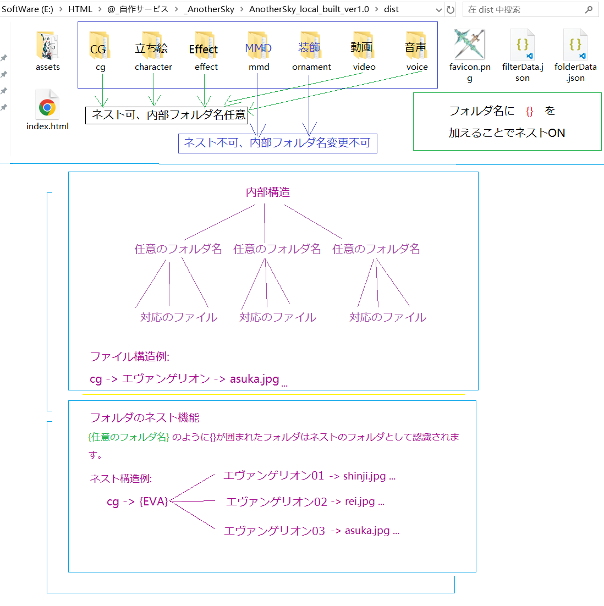
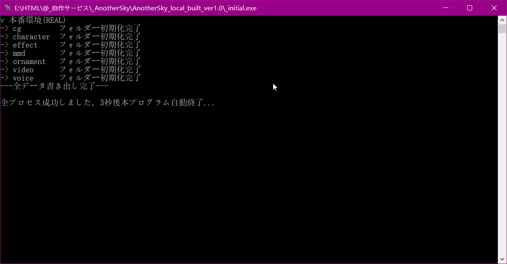
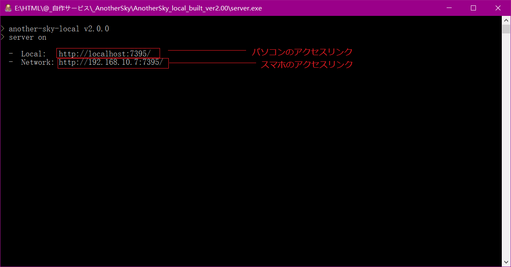

## ローカル環境で構築する方法

- 簡単に流れを説明
1. 自分のパソコンにNodejsをインストール

2. Releasesから最新バージョンのビルド済みのコードをダウンロード

3. _start.batを実行してプログラムを作動テスト(ctrl + cでサーバー終了)

4. 成功したらdistフォルダの下で自分の欲しいメディアファイルを配置

5. _init.extを実行してメディア情報を初期化 (「本番環境(REAL)」を選択)

6. _start.batを実行してプログラムを作動(ctrl + cでサーバー終了)

***
#### dist フォルダ中身の説明


***
#### _init.exe（メディア情報初期化）成功の場合


***
#### _start.bat（プログラムを作動）成功の場合


***
### 追記
自分の作動環境: Windows + Google Chrome

もしご自身のパソコンが以下のように画面拡大倍率が設置された場合、


ブラウザ内部の解像度は下げてしまいますので、実際レンダリングされた画像の画質も下げます、特に問題になるのはアプリ内の各ボタンも拡大されてしまいます、以下のコードをブラウザのショートカットに追加すれば問題が解決できます。(コード先頭の半角スペースの空白も必要です、ご注意)
```
 --force-device-scale-factor=1
```


***
> [アプリ操作方法参照](https://github.com/Gladiale/AnotherSky_Web)

